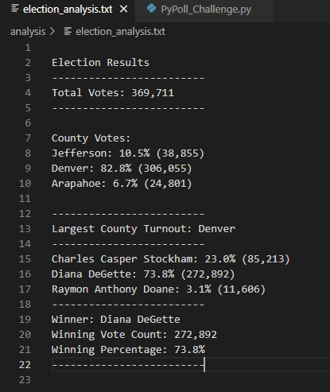

# Election Analysis with Python
You can find the Analysis file here: [Python_Election Analysis](https://github.com/NedaAJ/Election-Analysis/blob/main/PyPoll_Challenge.py)

## Overview of Election Audit

The purpose of this challenge was to complete an election analysis of a local congressional election with following tasks:

- Total number of votes cast
- A complete list of candidates who received votes
- Total number of votes each candidate received
- Percentage of votes each candidate won
- The winner of the election based on popular vote
- The voter turnout for each county
- The percentage of votes from each county out of the total count
- The county with the highest turnout

## The data
The data was the election results in a **csv file** format with three columns: **Ballot ID, County and Candidate Name**.

## Election Analysis Results

Here, you can see an image of ***summarized election*** results based on our analysis:

As you can see, the *total number of votes* for this local congressional elections was **369,711** votes of which **Denver** had the highest number of votes (306,055), winning **82.8%** of the total votes. *Jefferson county* with **10.5% (38,855 votes)** and **Arapahoe county** with **6.7% (24,801)** of the total votes are in *second* and *third place*.

Among candidates, **Diana DeGette** had receieved highest number of votes, which was **272,892** votes, setting her as the **winner candidate** with ***73.8%*** of the total votes. Candidates **Charles Casper Stockham** and **Raymon Anthony Doane** with *23% (85,213 votes)* and *3.1% (11,606 votes)* of the overall votes took *second* and *third* places. 

